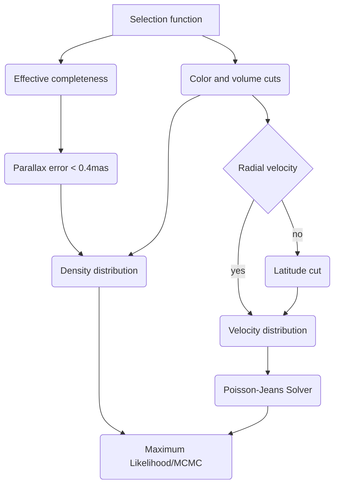

```mermaid
graph TD;
  A[Selection function] -->B(Effective completeness)
  A --> C(Color and volume cuts)
  B --> D(Parallax error < 0.4mas)
  C --> E{Radial velocity}
  D --> F(Density distribution)
  E -->|yes| G(Velocity distribution)
  E -->|no| H(Latitude cut)
  C --> F
  H --> G
  G --> I(Poisson-Jeans Solver)
  F --> J(Maximum Likelihood/MCMC)
  I --> J
```
